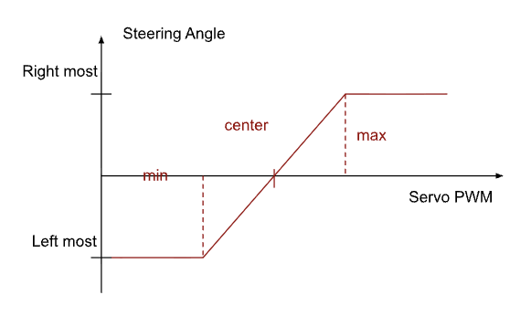
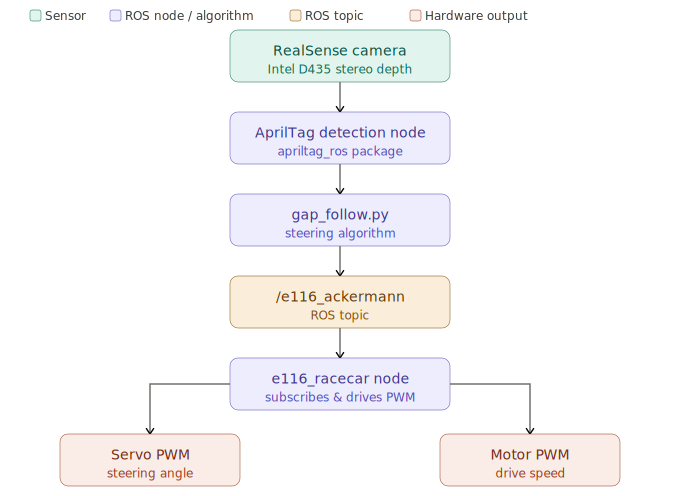

# Documenting our journey in E116 by Lehigh University

## Table of Contents

1. [Week 1 — Hardware Familiarization &amp; Linux Basics](#week-1)
2. [Week 2 — Teleop, PWM Tuning &amp; ROS 2 Introduction](#week-2)
3. [Week 3 — Stereo Camera &amp; AprilTag Detection](#week-3)
4. [Week 4 — Gap Follow Algorithm &amp; Race Preparation](#week-4)
5. [References](#references)

---

## Week 1 — Hardware Familiarization & Linux Basics

### Overview

The first lab session introduced the E116 autonomous race car platform, its hardware components, and the Ubuntu Linux environment running on the NVIDIA Jetson Orin Nano. The session bridged electrical fundamentals (AC/DC power, battery chemistry) with embedded computing concepts.

---

### Key Concepts

#### 1.1 Battery Chemistry

Two battery types power the car:

| Battery        | Chemistry            | Nominal Voltage | Use                    |
| -------------- | -------------------- | --------------- | ---------------------- |
| LiPo (OVONIC)  | Lithium Polymer      | 11.1 V (3S)     | Jetson / compute power |
| NiMH (Traxxas) | Nickel-Metal Hydride | 7.2 V (6-cell)  | Drive-train ESC        |

**Rechargeable v/s Primary:** Rechargeable batteries (LiPo, NiMH) can be cycled hundreds of times via controlled charge/discharge. Primary batteries (e.g., alkaline) undergo irreversible electrochemical reactions and are single-use.

**LiPo C-rating** - defines maximum safe continuous discharge current:

$$
I_{max} = C \times \text{Capacity (Ah)}
$$

*Example: 50C × 1.4 Ah = 70 A maximum continuous draw.*

> ⚠️ **Safety:** Never discharge a LiPo below ~3.5 V/cell. The onboard battery checker beeps as a warning.

On the E116, the LiPo battery can be replaced with a barrel jack for convenience while testing and debugging code.

[](NiMH.mp4)

[](LiPo.mp4)

#### 1.2 Brushless Motor vs. Brushed Motor

| Feature     | Brushed            | Brushless  |
| ----------- | ------------------ | ---------- |
| Commutation | Mechanical brushes | Electronic |
| Efficiency  | Lower              | Higher     |
| Maintenance | Brush wear         | Minimal    |
| Cost        | Lower              | Higher     |

The E116 uses a Velineon® 380 brushless motor paired with an Electronic Speed Controller (ESC). The ESC drives the motor by switching the phase currents electronically.

---

#### 1.3 GPU vs. CPU — NVIDIA Jetson Orin Nano

|            | CPU                    | GPU                           |
| ---------- | ---------------------- | ----------------------------- |
| Core count | Few (high clock speed) | Thousands (lower clock speed) |
| Best for   | Serial, branchy logic  | Parallel numerical workloads  |
| On Jetson  | ARM Cortex-A78AE       | Ampere GPU (1024 CUDA cores)  |

The **NVIDIA Jetson Orin Nano** is a compact **System-on-Module (SoM)** designed for edge AI inference combining CPU, GPU, and memory in a low-power package suitable for an autonomous vehicle.

---

#### 1.4 Ubuntu Linux Basics

Key commands practiced in the terminal:

```bash
ls -al               # list files with permissions
cd folder / cd ..    # navigate directories
mkdir new_folder     # create directory
cp file1 file2       # copy file
mv src dst           # move/rename
rm -r folder         # remove recursively
chmod a+x file.py    # make executable
grep pattern file    # search text
python3 script.py    # run Python script
```

**File permissions** are displayed as `drwxr-xr-x`:

- `d` = directory, `-` = file
- `r` = read, `w` = write, `x` = execute
- Three groups: owner | group | others

---

### Demo Video

[](Hardware_Overview.mp4)

---

### Week 1 - Problems Encountered

Charging the LiPo battery was confusing at first. We were unsure what voltage and current rating to charge at. There was also no way to know when the Traxxas battery was discharged, and we weren't able to get the multimeters working reliably. So, we ended up sourcing a Traxxas battery charger to see the amount that it was charged.

## Week 2 — Teleop, PWM Tuning & ROS 2 Introduction

### Overview

Week 2 moved from static hardware inspection to active control. The car was driven manually via keyboard (Teleop), PWM parameters were calibrated to the specific car's mechanical tolerances, and ROS 2 Humble was introduced through the Turtlesim tutorial and publisher/subscriber examples.

---

### Key Concepts

#### 2.1 PWM Motor and Steering Control

**Pulse Width Modulation (PWM)** encodes a command as the duty cycle of a periodic digital signal.

$$
\text{Duty Cycle} = \frac{t_{on}}{T} \times 100\%
$$

The E116 uses **200 Hz** PWM. The duty cycle is represented as an unsigned 8-bit integer mapped to 0–100%:

$$
\text{Step size} = \frac{100\%}{2^8} \approx 0.39\%\text{/step}
$$

**Motor deadband:** The ESC has a neutral zone where no motion occurs. Parameters tuned:

| Parameter                | Typical Range         |
| ------------------------ | --------------------- |
| `motor_forward_start`  | 30.00 – 31.50 % duty |
| `motor_backward_start` | 27.50 – 29.00 % duty |
| `servo_center`         | ~29.70 % duty         |

The values found were input into the configuration files for the car, and used for the rest of the assignments.




---

#### 2.2 SSH — Secure Shell Remote Access

SSH allows a host laptop to run programs on the Jetson over WiFi:

```bash
ssh -X username@ipaddress
```

The `-X` flag enables X11 forwarding so GUI windows (like gedit) appear on the host. Once connected, all commands execute on the remote Jetson.

[](Week1_SSH.mp4)

---

#### 2.3 ROS 2 — Nodes, Topics, Publishers & Subscribers

**ROS 2 (Robot Operating System 2)** is a middleware framework for building modular robot software. **Humble** is one of the versions, or distributions of ROS 2 that we are using.

Core communication model:

```
[Publisher Node] --→ /topic_name --→ [Subscriber Node]
```

Key concepts:

| Concept                | Description                                           |
| ---------------------- | ----------------------------------------------------- |
| **Node**         | An independent process (e.g., motor driver, camera)   |
| **Topic**        | A named channel for streaming messages                |
| **Publisher**    | A node that sends data to a topic                     |
| **Subscriber**   | A node that receives data from a topic                |
| **Message type** | Structured data schema (e.g.,`geometry_msgs/Twist`) |

Essential CLI commands:

```bash
ros2 node list
ros2 topic list
ros2 topic echo /turtle1/cmd_vel
ros2 topic pub /turtle1/cmd_vel geometry_msgs/msg/Twist \
  "{linear: {x: 2.0, y: 0.0, z: 0.0}, angular: {x: 0.0, y: 0.0, z: 1.8}}"
ros2 run rqt_graph rqt_graph
```

[](turtlesim.mov)

---

#### 2.4 Vehicle Dynamics — Roll, Pitch, Yaw

The car's orientation is described by three Euler angles:

| Angle           | Axis             | Motion             |
| --------------- | ---------------- | ------------------ |
| **Roll**  | X (longitudinal) | Tipping left/right |
| **Pitch** | Y (lateral)      | Nose up/down       |
| **Yaw**   | Z (vertical)     | Turning left/right |

The E116 controls **yaw** via the steering servo and longitudinal speed via the drive motor. The **Common Road vehicle model** treats the car as a rigid body constrained to a 2D plane, with steering modeled by Ackermann geometry.

---

### Demo Video

[Telop Video](Teleop.mp4)
> **[VIDEO PLACEHOLDER]** *PWM Tuning*
> @ANANYA PLS PUT AN EDITED VIDEO OF PWM TUNING - BOTH MOTOR AND SERVO

---

### Week 2 — Problems Encountered

The battery discharged quite quickly, not allowing us to tune the PWM properly. We realised that the battery has to be fully charged (12.6V) and not even slightly below, like 12.3V to get a reasonable duration of charge. This because battery discharge curves are not linear.

---

## Week 3 — Stereo Camera & AprilTag Detection

### Overview

Week 3 integrated the Intel RealSense D435 stereo camera into the ROS 2 ecosystem. A new workspace was built with the AprilTag detection library, enabling the car to recognize fiducial markers and estimate their 6-DOF pose in real time. The Teleop was also migrated to a full ROS 2 launch-file architecture.

---

### Key Concepts

#### 3.1 ROS 2 Workspace and Package Structure

```
team_ws/
├── src/
│   ├── e116/               ← custom car package
│   │   ├── e116/           ← Python nodes
│   │   ├── launch/         ← .launch.py files
│   │   └── config/         ← e116.yaml parameters
│   ├── apriltag/           ← C++ detection library
│   ├── apriltag_ros/       ← ROS 2 wrapper
│   └── apriltag_msgs/      ← message definitions
├── build/                  ← generated by colcon
├── install/                ← install tree
└── log/                    ← build logs
```

Build workflow:

```bash
cd ~/team_ws
colcon build
source install/setup.bash   # must re-source after every build
```

> ⚠️ **Always `cd` to the workspace root before `colcon build`.** Sourcing `install/setup.bash` registers the new packages in the ROS 2 environment.

---

#### 3.2 AprilTag Fiducial Markers

**AprilTags** are 2D binary fiducial markers that encode an integer ID. The detection algorithm computes the full **6-DOF pose** (position + orientation) of the tag relative to the camera.

The tag family used: **tag36h11** — a 6×6 bit payload with error-correcting coding.


**Pose estimation** from a known tag size and camera intrinsics uses the PnP (Perspective-n-Point) algorithm, solving for the rotation matrix $R$ and translation vector $t$ such that:

$$
\mathbf{p}_{img} = K \left[ R \mid t \right] \mathbf{P}_{world}
$$

where $K$ is the camera intrinsic matrix.

---

#### 3.3 Coordinate Axes in RViz

RViz displays coordinate frames as RGB-colored axes:

| Color           | Axis | Direction               |
| --------------- | ---- | ----------------------- |
| **Red**   | X    | Forward (out of camera) |
| **Green** | Y    | Left                    |
| **Blue**  | Z    | Up                      |

When an AprilTag is detected, an additional frame appears anchored to the tag. Moving the tag physically causes the axes to move in RViz in real time, confirming successful 6-DOF tracking.


---

#### 3.4 Ackermann Drive ROS Topic

The ROS 2 teleop node publishes to `/e116_ackermann` using the **AckermannDriveStamped** message type:

```
ackermann_msgs/AckermannDriveStamped
  header:
    stamp: ...
    frame_id: "base_link"
  drive:
    steering_angle: <radians>
    speed: <m/s>
```

The `/e116_racercar` subscriber receives this message and converts steering angle + speed to PWM duty cycles for the servo and ESC.

---

### Week 3 — Problems Encountered

Most of the problems we encountered were to do with setting up teleop in the intended manner. Window forwarding wasn't working properly, so the pygame window never popped up. Thus, we created our own terminal app for teleop on ROS that took WASD inputs.

---

## Week 4 — Gap Follow Algorithm & Race Preparation

### Overview

Week 4 integrated all prior skills into an autonomous navigation algorithm: **Gap Follow**. The car uses AprilTag detections from the RealSense camera to identify free space between left-wall tags (100-series) and right-wall tags (200-series), then steers toward the midpoint gap.

---

### Key Concepts

#### 4.1 Gap Follow Algorithm

The Gap Follow algorithm is a **reactive planning** method. It makes steering decisions purely from the current sensor reading, with no map or global planner.

**Algorithm logic (camera-based AprilTag version):**

1. Detect AprilTags in the camera frame
2. Classify by ID: 100-series = left wall, 200-series = right wall
3. Compute the horizontal position of each detected tag group
4. Steer toward the **midpoint** between the left-tag centroid and right-tag centroid
5. Adjust speed based on tag proximity and confidence

**Key tunable parameters in `gap_follow.py`:**

| Parameter        | Effect                                      |
| ---------------- | ------------------------------------------- |
| `SPEED1`       | Nominal cruising speed                      |
| `SPEED2`       | Reduced speed (e.g., near corners)          |
| `turningAngle` | Maximum steering angle (radians)            |
| `angle_scale`  | Gain mapping tag offset → steering command |

The steering command maps to the `/e116_ackermann` topic and ultimately to the servo PWM:

$$
\delta = \text{angle\_scale} \times \Delta x_{tags}
$$

where $\Delta x_{tags}$ is the horizontal offset of the gap center from the image center.



---

#### 4.2 Headless Operation & Hot Power Swap

For track racing the car operates **headlessly** (no monitor/keyboard). The workflow:

1. SSH into Jetson from host laptop (both on same WiFi)
2. Launch all ROS nodes via SSH
3. Remove AC adapter, connect LiPo + NiMH batteries
4. Place car on track

**Hot power swap** — replacing a depleted LiPo while the AC adapter is still connected keeps the Jetson running, avoiding a reboot:

```
AC adapter connected → swap LiPo → disconnect AC adapter → continue
```

---

#### 4.3 Race Track Layout

```

```

100-series (Left)                200-series (Right)
|                                |
|               ↑                |
|            [PATH]              |
|               ↑                |
|                                |

```

```

---

#### 4.4 Iterative Tuning Workflow

```bash
# Edit parameters
vi ~/team_ws/src/e116/e116/gap_follow.py

# Rebuild only the e116 package (faster than full build)
cd ~/team_ws
colcon build --packages-select e116
source install/setup.bash

# Relaunch
ros2 launch apriltag_ros rs2camera_tag.launch.yml &
ros2 launch e116 e116race.launch.py
```

This loop — edit → build → test → observe → edit — is the fastest way to tune the algorithm.

Additionally, to help with debugging Foxglove can be installed into ROS 2 and used to visualize the camera feed and the April Tags' pose relative to the robot. This can be done through:

```bash
# Install the bridge package
sudo apt update
sudo apt install ros-humble-foxglove-bridge

# Launch the bridge
ros2 launch foxglove_bridge foxglove_bridge_launch.xml
```

### Demo Video

[Video of FWG](FWG(1).mp4)

### Week 4 - Problems Encountered


## References

1. **ROS 2 Humble Documentation** — [https://docs.ros.org/en/humble/](https://docs.ros.org/en/humble/)
2. **Intel RealSense D435 Product Page** — [https://store.realsenseai.com](https://store.realsenseai.com)
3. **AprilTag Library (AprilRobotics)** — [https://github.com/AprilRobotics/apriltag](https://github.com/AprilRobotics/apriltag)
4. **AprilTag ROS 2 Wrapper** — [https://github.com/christianrauch/apriltag_ros](https://github.com/christianrauch/apriltag_ros)
5. **Traxxas 1/16 E-Revo VXL** — [https://traxxas.com/71076-8-116-e-revo-vxl-wbattery](https://traxxas.com/71076-8-116-e-revo-vxl-wbattery)
6. **NVIDIA Jetson Orin Nano** — [https://www.nvidia.com/en-us/autonomous-machines/embedded-systems/jetson-orin/](https://www.nvidia.com/en-us/autonomous-machines/embedded-systems/jetson-orin/)
7. **Ubuntu Command Line for Beginners** — [https://ubuntu.com/tutorials/command-line-for-beginners](https://ubuntu.com/tutorials/command-line-for-beginners)
8. **F1TENTH Gap Follow — Zhihao Ruan** — [https://zhihaoruan.xyz/f1tenth-lab4/](https://zhihaoruan.xyz/f1tenth-lab4/) *(style inspiration)*

---

### Acknowledgements

Special thanks to **Professor Rosa Zheng** of the Department of Electrical and Computer Engineering at **Lehigh University** for designing the E116 course curriculum, the custom carrier board, and the lab instruction materials that form the basis of this journal. The E116 platform represents a thoughtful integration of embedded systems, robotics middleware, computer vision, and autonomous control — making graduate-level autonomous systems concepts accessible and hands-on.

---

*Lab journal compiled from ECE Lab Weeks 1–4 instruction documents. All hardware descriptions, parameter values, and ROS commands reference the E116 platform as developed at Lehigh University.*

---

### Learnings from E116 for RoboRacer-mini
