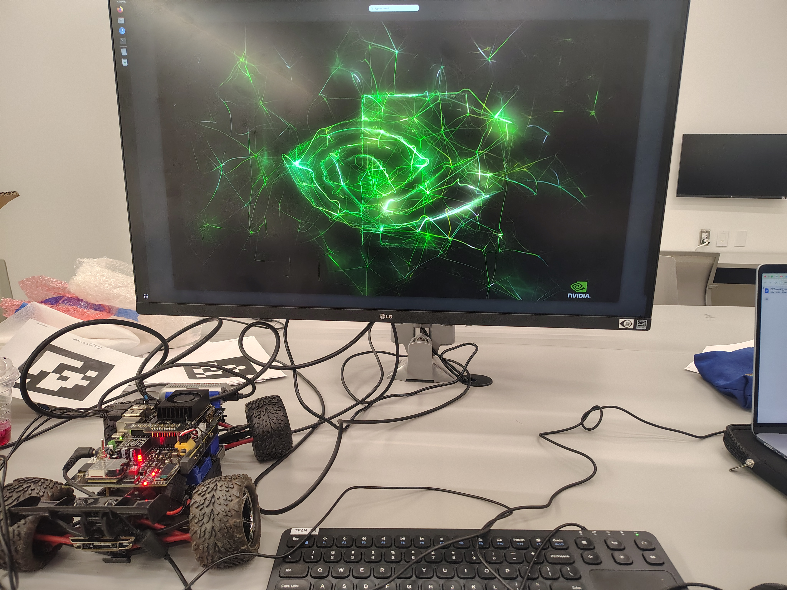
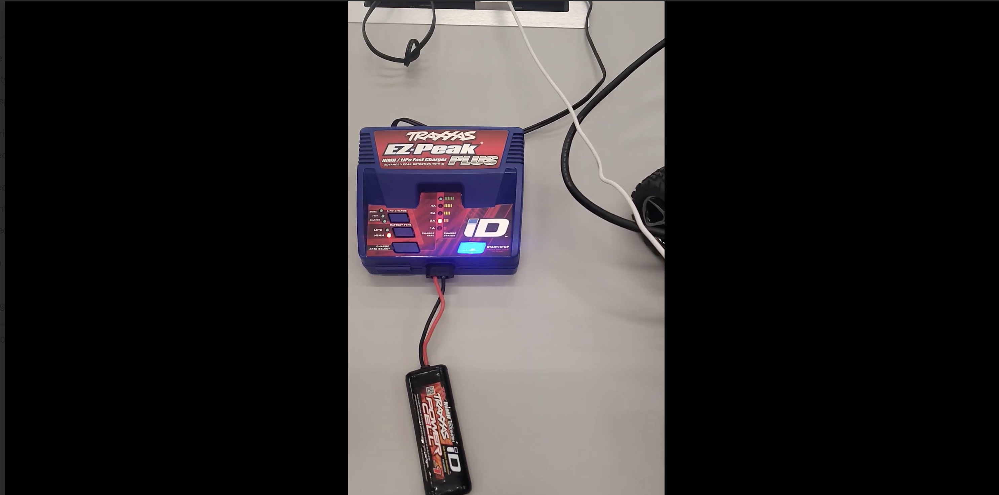
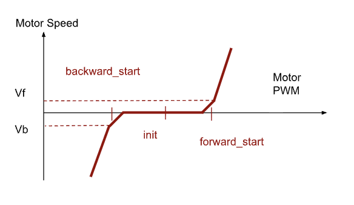

# Documenting E116 by Lehigh University

Setting-up, driving, developing racing algorithms on a 1/16-scale autonomous race car.  

<p align="center">
  
</p>

# Week 1 — Understanding the Car

The E116 is built on a **Traxxas 1/16** chassis. This is a small all-wheel-drive car with Ackerman steering geometry. The stock Traxxas electronics (ESC, receiver) handle manual control, while an **NVIDIA Jetson Orin Nano** and a **custom carrier board** sit on top to enable autonomous operation. An **Intel RealSense D435i** stereo camera provides depth + RGB perception.

[](Videos/Week1/Hardware_Overview.mp4)

## Bill of Materials

TODO: correct links for these:

| Component name | model number | website and price | function and features |
| :--- | :--- | :--- | :--- |
| Traxxas 1/16 scale car | [1/16 E-Revo VXL TSM](https://traxxas.com) | | |
| Brushless motor | Velineon® 380 | | |
| RC Handheld | TQi 2.4GHz TSM | | |
| Dual Battery Charger | EZ-Peak 8 amp 3s | [Traxxas](https://traxxas.com) | |
| LiPo battery charger | X1, 200W | [OVONIC](https://ampow.com) | |
| LiPo battery | | OVONIC | |
| NiMH battery | | Traxxas | |
| Real-sense Stereo camera | [D435](https://www.intelrealsense.com/depth-camera-d435/) | Intel → Real Sense | |
| Jetson Development Kit | [Orin Nano 8 GB](https://www.nvidia.com/en-us/autonomous-machines/embedded-systems/jetson-orin/) | | |
| LU Carrier Board | Version 2.1 | $105 in 2023 | See Appendix B |
| Estimated total cost | E116 AutoCar V1 | Lehigh ECE | |

## Carrer Board

This is a custom designed PCB to interface the Jetson with the power supply and the rest of the car's components.

The carrier board is a custom PCB that sits between the Jetson and the Traxxas chassis. It handles everything the Jetson can't do natively — power regulation, motor control signals, sensor routing, and status monitoring.


| Block | Function |
|-------|----------|
| **Main Power** | Barrel connector input, voltage regulation, battery level checker |
| **Jetson Signal Interface** | Routes GPIO, I2C, UART between carrier and Orin Nano header |
| **Drive Control** | PWM output signals to the motor ESC and steering servo |
| **Sensing & Control** | Connectors for external sensors |
| **Comm Ports** | I2C and UART breakout headers for peripherals |
| **External IMU Interface** | Dedicated connector for an inertial measurement unit |
| **Status LEDs 1–4** | Indicate: power good, drive-train active, Jetson alive, RC link |
| **Mode Switch** | Selects between operating modes |
| **0.92″ OLED Screen** | Displays IP address, WiFi name, and real-time status |

---

## Charging the batteries

The car uses two types of rechargeable batteries:

| Battery | Spec | Connector | Car Slot |
|---------|------|-----------|----------|
| **LiPo** | OVONIC 11.1V 1400mAh 3S 50C | XT60 power + 4-pin JST XH balance | Left |
| **NiMH** | Traxxas 7.2V 1200mAh 6-cell | Traxxas connector | Right |

Both batteries were measured with a multimeter in DC V mode. The readings were compared against the label values, and the LiPo was then cross-checked with a standalone battery tester — both readings matched.

| Parameter | LiPo (3S) | NiMH (6-cell) |
|-----------|-----------|---------------|
| Nominal voltage | 11.1V (3.7V × 3) | 7.2V (1.2V × 6) |
| Fully charged | ~12.6V (4.2V/cell) | ~8.4V (1.4V/cell) |
| Capacity | 1400mAh | 1200mAh |
| C rating | 50C → 70A max burst | — |
| Low voltage warning | ~9.9V (3.3V/cell) | — |

The C rating determines max safe discharge: 50C × 1.4A = 70A burst. The battery checker on the carrier board warns when the LiPo drops below ~3.3V/cell.

Here is how to charge both:

[](Assets/Week1/NiMH.mp4)

[](Assets/Week1/LiPo.mp4)

The following steps were followed to plug the battery into the car:
- **NiMH** - plug into traxxas connector to connect to drivetrain, and place in the right battery slot
- **LiPo** - plug via 4S JST balance lead to the carrier board, and place in the left battery slot 
- Close the covers and tuck all cables away from the wheels
- The battery checker on the carrier board beeped loudly and display ~11.1V before proceeding further

Some of the battery best practices we learned are:
- **Never fully drain a LiPo** — deep discharge below 3.0V/cell permanently damages the cells
- **Charge at 1C or below** — 1A for a 1400mAh pack. Faster charging degrades battery life
- **Rubber-band a battery** after it's fully charged so you can tell which ones are ready at a glance
- **Unplug all batteries** when leaving the lab — even a slow parasitic drain overnight degrades LiPo chemistry
- **Storage voltage** — if not using for an extended period, store LiPo at ~3.8V/cell (~11.4V for 3S)


## Powering on the car

The car was powered on, following these steps:
- Power jack on the carrier board was connected through a power adapter to a wall outlet
- NiMH battery was connected to its connector
- Switch on carrier board was flipped

To access the Jetson, a monitor was connected via the display port and a keyboard and mouse were connected via USB-A.

[](Assets/Week1/Power_On.mp4)

The NVIDIA splash screen appears, followed by the Ubuntu 22.04 login window. The system was logged into using known credentials. If the Jetson has not already been setup, then create an account. Connect to a local Wi-Fi network via the GUI interface that comes up on the display.

TODO: 
>
> ### Questions to check concepts:
>
> Q1.1. What are the types of batteries used in the car? What is the difference between a rechargeable battery and a primary battery? 
>
> Q1.2. What is the difference between an AC power source and a DC power source?  What is a DMM?
>
> Q1.3 What are the types of batteries used in the car? What is the difference between a rechargeable battery and a primary battery? 
>
> Q1.4 What is the voltage of the LiPo battery when it is fully charged?  At what voltage would the battery checker warn you that the LiPo battery needs to be charged?
>
> Q1.5 What is an all-wheel drive system? What is an Ackerman steering system?  
>
> Q1.6 What are the differences between a brushed motor and a brushless motor? 
>
> Q1.7 What are the differences between the single and stereo cameras? 
>
> Q1.8 What is a GPU? How different is it from a CPU? What is an Nvidia Jetson?
>
> Q1.9 What problems did you encounter working through the hardware Part of this lab? 
>
> Q1.10 What did you learn or enjoy most in the Hardware Part of this lab? What suggestions would you explore further for your own interests? 
>

## Installing packages and requirements

TODO (from TA setup instructions)

## Getting familiar with Ubuntu and the Jetson's software

The cheat sheet below will help with navigating the Terminal:

| Command | What It Does |
|---------|-------------|
| `ls -al` | List all files (including hidden) with permissions |
| `cd` / `cd ..` / `cd ~` | Navigate into folder / up one level / home |
| `mkdir name` | Create a new directory |
| `cp src dest` | Copy a file |
| `mv src dest` | Move or rename |
| `rm -r dir` | Delete a directory and its contents |
| `grep pattern file` | Search for text inside a file |
| `chmod 755 file` | Set permissions: owner rwx, others rx |
| `Tab` | Auto-complete file/folder names |
| `Ctrl+C` | Kill a running process |
| `Ctrl+Z` | Suspend a process |
| `Ctrl+D` | Exit the current shell |

---

In the terminal, the Documents folder was opened and a new directory called Week1 was made. Inside this, the ```game.py``` file was created and the contents written.

```bash
$ cd ~/Documents
$ mkdir Week1
$ cd Week1
$ vim game.py
```

TODO: Access the game.py file in the codebase section.

A tutorial for ```vim``` is here: https://missing.csail.mit.edu/2020/editors/

The attribute of the ```game.py``` file was changed to be executable for all users and then it was executed.

```bash
$ chmod +x game.py
$ python3 game.py
```

> TODO: 
> Questions to check concepts
> 
> Q2.1 What operating system did you use for this part of Week1 lab? What is the version of the operating system on the Jetson device?
> 
> Q2.2 How do you open a new terminal in Linux? How do you copy and paste a command in a Terminal?  
> 
> Q2.3 What is the difference between a sudo command and a normal command?
> 
> Q2.4 What text editing tool do you use on Linux? How do you save the edits? How do you like it?
> 
> Q2.5 How do you check and change the access property (r,w,x) of a file? Show the result of your exercise to TA.
> 
> Q2.6 What is tab completion and how do you use it? Demo this to TA. 

# Week 2 - Running Teleop and ROS

<!-- 
WE NEVER DID THIS OLED SETUP BECAUSE IT NEVER WORKED

## 10 · OLED Display Setup

The carrier board has a **0.92″ OLED screen** (128×32 pixels, I2C interface, Waveshare module) that displays the car's IP address and WiFi network name — essential for SSH access later.

### Setup

`startup_files.zip` was extracted to the home directory, and the files were verified to be in place:

```bash
$ cd ~
$ ls
  startupOLED.sh  startupOLED/  ...
```

The `startupOLED/` folder contains a Python script that communicates with the OLED over I2C using the `smbus` library.

### Running It

```bash
$ ./startupOLED.sh &
```

The `&` runs it in the background and prints a process ID. The OLED should now display the WiFi name and IP address.

If you see `ModuleNotFoundError: No module named 'smbus'`:
```bash
$ pip3 install smbus
$ ./startupOLED.sh &
```


<!-- OLED on the carrier board showing IP address and WiFi name -->

<!-- ### How the Shell Script Works

`startupOLED.sh` was opened in a text editor. It is a simple shell script that calls the Python program inside the `startupOLED/` folder, which initializes the I2C bus, reads the system's IP and WiFi information, and writes it to the OLED display buffer.

https://github.com/user-attachments/assets/VIDEO_ID_HERE -->
<!-- VIDEO: Running startupOLED.sh and seeing the IP appear on the OLED -->

## Writing a program for Teleop and running it

Using the Terminal, a new folder was created in ~/Documents for Week2 and then using vim a file called ```teleop_terminal.py``` was created.

```bash
$ cd ~/Documents
$ mkdir Week2
$ cd Week2
$ vim teleop_terminal.py
```

The code in ```teleop_terminal.py``` is as follows:

```python
# TODO
```

[[ TODO: insert code walkthrough and explanations here ]]

Running the python script and then using WASD keys to control the car (W - Forward,   A - Turn left,  S - Backward,  D - Turn right):

[](Assets/Week2/Week2_telop.mp4)

If the code does not work, then double check that the ESC is blinking green. If it is not, then press the small blue button on the ESC.

## PWM Tuning

### Setting up SSH

To tune the PWM for the car, the car would have to be run on the ground and not just on the desk. Thus, there needs to be a means of controlling the vehicle remotely and not only when plugged into a display. To enable this, SSH was setup.

The Jetson was connected to the same Wi-Fi network as the laptop. Then, the following commands were run to find the IP address of the Jetson:

```bash
$ hostname -I
```

The IP address was then used to connect to the Jetson from a laptop using SSH.

```bash
$ ssh team1XX@<CAR_IP_ADDRESS>
```

SSH allows the Jetson terminal to be opened and controlled from another computer over the same Wi-Fi network, without needing to stay directly connected through a monitor, keyboard, and mouse.

### How PWM Works on the E116

The **servo PWM** port controls steering, and the **motor PWM** port controls speed through the ESC. Each car is built slightly differently, so you need to find the exact PWM parameters for your specific car.

The PWM signal runs at **200 Hz**. The duty cycle is controlled by an **unsigned 8-bit integer** (0–255), mapping to 0–100% duty. This means the minimum step size is 100/256 ≈ 0.39%.

The motor has a **deadband** in its PWM input, which is a range of duty cycles where the motor doesn't move. This prevents the car from jumping between forward and backward. There are also **transition bands** at the edges of the deadband where the motor just barely starts moving. Finding these edges is the goal of this step.

The graphs below demonstrate this concept:




We need to find the values of PWM duty cycle that are just at the point where the curves begin to bend, to find the minimum PWM for forward, backward, and turning left and right.   

### PWM tuning for motor

The following script, ```pwm_motor.py```, finds appropriate motor PWM values.

```python
# TODO: Insert code walkthrough and explanations here
```

The program prompts you to enter duty cycle values. You can type exact numbers (up to 2 decimal places) or use `+` and `-` for fine-tuning in 0.01 increments. For each value entered, the car runs for 0.6 seconds then stops. 

This program was run when the car is on the ground, and not on a stand, because the PWM values are heavily influenced by friction on the surface that needs to be overcome.

Before running the program, the LiPo was connected to its slot and tightly fastened in place. The AC-DC adapter, monitor, keyboard, and mouse from the car were disconnected from the car.

The value at which the motor just barely starts moving, first forward, and then backward was noted down. These values were recorded for the motor calibration and will be used later.

### PWM tuning for servo

Here, the PWM value for the servo was found that allows the car to drive perfectly straight. This is the only reference needed to enable the servo to turn to other angles accurately. Here too, the car was controlled remotely via SSH from a host laptop.

The following script was used:

```python
# TODO: Insert code walkthrough and explanations here
```

After opening `pwm_steering.py` in a text editor, the following values were updated:
  - **Line 26**: `motor_forward_start` value
  - **Line 27**: `motor_backward_start` value
  - **Line 28**: desired speed (leave at 2 initially)

Then the program was run with the car on the ground with a clear path straight ahead. Every time a new **servo_center** value was entered, the car would drive straight for a short distance and then stop. The straightness of the run was observed and the value was adjusted until the car drove straight. 

In some cases, it helped to tune Line 28 (speed) or Line 62 (duration) in `pwm_steering.py` to test at different speeds and over longer distances.

TODO: Enter video


---
---
---
---

## 14 · ROS 2 Humble — Getting Started

ROS 2 Humble was pre-installed on the Jetson. This section covers environment configuration, the turtlesim demo (nodes, topics, pub/sub), and building a workspace with colcon.

### One-Time Environment Setup

```bash
$ echo "source /opt/ros/humble/setup.bash" >> ~/.bashrc
$ echo "export ROS_LOCALHOST_ONLY=1" >> ~/.bashrc
$ source ~/.bashrc
```

This adds ROS 2 sourcing to your shell config so every new terminal is automatically configured.

### Turtlesim — Nodes, Topics & Messages

Turtlesim is a simple graphical simulator that demonstrates ROS 2 concepts. You need **4 terminals** for this:

**Terminal 1** — Launch the turtlesim window:
```bash
$ ros2 run turtlesim turtlesim_node
```

**Terminal 2** — Drive the turtle with arrow keys:
```bash
$ ros2 run turtlesim turtle_teleop_key
```

**Terminal 3** — Inspect the ROS 2 graph:
```bash
$ ros2 node list          # shows active nodes
$ ros2 topic list         # shows active topics
$ ros2 node info /turtlesim
$ ros2 topic echo /turtle1/cmd_vel    # shows velocity commands in real-time
```

**Terminal 4** — Launch the ROS 2 graph visualizer:
```bash
$ rqt_graph
```

This shows how nodes connect through topics. The `/teleop_turtle` node publishes `geometry_msgs/msg/Twist` messages on `/turtle1/cmd_vel`, which the `/turtlesim` node subscribes to.

### Publishing Directly from the Terminal

```bash
$ ros2 topic pub /turtle1/cmd_vel geometry_msgs/msg/Twist \
  "{linear: {x: 2.0, y: 0.0, z: 0.0}, angular: {x: 0.0, y: 0.0, z: 1.8}}"
```

This makes the turtle drive in a circle. The `linear.x` field controls forward speed, `angular.z` controls rotation. Try negative values and observe what happens — negative `x` drives backward, negative `z` turns the other way.


<!-- turtlesim window with the turtle drawing a path -->


<!-- rqt_graph showing node/topic connections -->

https://github.com/user-attachments/assets/VIDEO_ID_HERE
<!-- VIDEO: Turtlesim demo — teleop, topic echo, and direct publishing -->

### Building a ROS 2 Workspace with Colcon

A workspace directory was created, the ROS 2 examples were cloned, and everything was built:

```bash
$ mkdir -p ~/ros2_ws/src
$ cd ~/ros2_ws
$ git clone https://github.com/ros2/examples src/examples -b humble
$ colcon build --symlink-install
$ colcon test
$ source install/local_setup.bash
```

If `colcon` isn't found: `sudo apt install python3-colcon-common-extensions`

### Publisher/Subscriber Test

The minimal C++ pub/sub example was run to verify the build:

**Terminal 1** — Subscriber (waits for messages):
```bash
$ ros2 run examples_rclcpp_minimal_subscriber subscriber_member_function
```

**Terminal 2** — Publisher (sends numbered messages):
```bash
$ ros2 run examples_rclcpp_minimal_publisher publisher_member_function
```

The subscriber prints each message as it arrives — confirms the ROS 2 middleware, build system, and node communication are all working.


<!-- two terminals side by side showing publisher and subscriber output -->

https://github.com/user-attachments/assets/VIDEO_ID_HERE
<!-- VIDEO: colcon build, then running publisher + subscriber in split terminals -->

---

## Safety

> **Car on a stand** when drive-train is powered — wheels spin fast and the car will launch off the bench.  
> **Power off** before disconnecting anything — hotplugging DC can arc and damage connectors.  
> **Match polarity every time** — reversing a LiPo kills the battery and the board.  
> **Unplug all batteries and switch off RC handheld** when done.  
> **Keep cables away from wheels** during teleop — they will get tangled.  
> **Hold connectors, not wires** when unplugging.

-

Enable GitHub Pages: **Settings → Pages → Source → main branch → / (root)**.  
Live at `https://YOUR_USERNAME.github.io/REPO_NAME/`.
