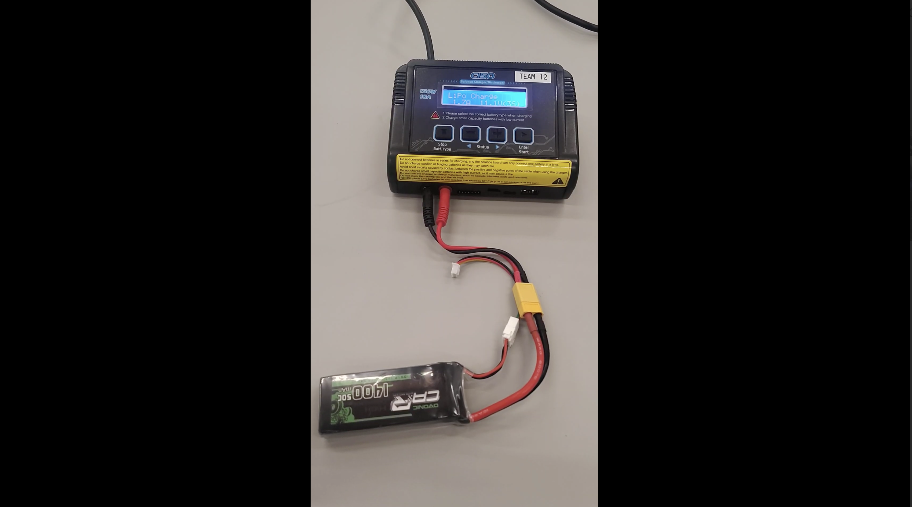

# E116 Build Log

Bring-up and first drive of a 1/16-scale autonomous race car.  
Traxxas E-Revo, Jetson Orin Nano, RealSense D435, custom carrier board.

`Orin Nano 8GB` · `RealSense D435` · `LU v2.1 Carrier` · `E-Revo VXL 1/16 AWD` · `ROS 2 Humble`

<p align="center">
  
</p>

# Week 1 — Hardware Bring-Up

## 01 · Hardware Overview

The E116 is built on a **Traxxas 1/16 E-Revo VXL** — a small all-wheel-drive car with Ackerman steering geometry. The stock Traxxas electronics (ESC, receiver) handle manual control, while an **NVIDIA Jetson Orin Nano** and a **custom carrier board (LU v2.1)** sit on top for autonomous operation. An **Intel RealSense D435** stereo camera provides depth + RGB perception.

<p align="center">

**Video Showing the Hardware Setup**
</p>
<p align="center">
  <a href="https://drive.google.com/file/d/1EaUpgWMUnqyIJ_EsmW8YUcG8p6_spHuw/view?usp=sharing">
    
  </a>
</p>

## 02 · Power Rail Verification

Before powering anything on the car, the entire power supply chain was verified with a **Digital Multimeter** (Fluke 8800A / GwInstek GDM-8245).

### AC Side

The power cord was plugged into the 120V wall outlet, the AC-DC converter was left disconnected, the DMM was set to **AC V** mode, and the voltage was measured across the cord terminals.

**Reading:** ~120 V RMS at 60 Hz — as expected for a US wall outlet.

### DC Side

The AC-DC converter was connected to the cord, the DMM was switched to **DC V** mode, and the barrel connector output was measured.


## 03 · Assembly Inspection

The entire car was inspected before first power-on:

- Checked carrier board standoff screws — a couple were slightly loose, tightened them
- Verified all wire connections: battery leads, motor wires, servo cable seated properly
- Confirmed correct polarity on every DC connection (red → V+, black → GND)
- Camera module mounted and USB cable firmly seated in the Jetson port
- No metal debris or loose parts that could cause a short

After these fixes, everything was found to be in order and the system was ready for power-on.


## 04 · First Power-On & Boot

### Power-On Sequence

1. A Dell monitor (via DisplayPort), USB keyboard, and mouse were connected to the Orin Nano
2. The AC-DC converter barrel was plugged into the **Main Barrel** connector on the carrier board
3. The **Main LED** turned on immediately — indicating that power was reaching the board
4. The **Jetson Power** button was pressed and the **Drive-train Power Switch** was flipped

The following was observed:
- ✅ Status LEDs 1–3 lit up on the carrier board
- ✅ Green LED on the Orin Nano module came on
- ✅ Cooling fan spun up

Video Demonstrating the power on process:
[Power On](https://drive.google.com/file/d/1E8DUts9J0zCCFHP2B0FsvDB4nNnh1jJv/view?usp=drive_link)


### Ubuntu Boot

8. Approximately 2 minutes were allowed for the Jetson to complete POST
9. The Dell monitor input was switched to **DisplayPort** (double-click 3rd button → Input Source → DisplayPort → OK)
10. The NVIDIA splash screen appeared, followed by the Ubuntu 22.04 login window

> ⚠️ **Safety:** Always place the car on a solid stand during power tests. Wheels will spin. Turn off all power switches before disconnecting any wires. Match red (+) to positive, black to GND.


## 05 · Ubuntu Setup

### Login

Ubuntu was logged into using the team credentials shown below. Replace `XX` with your car number:

| | Username | Password |
|---|----------|----------|
| Monday | `team1XX` | `robot1XXPA##!` |
| Wednesday | `team3XX` | `robot3XXPA##@` |

### Wi-Fi

| Network | Password | Room |
|---------|----------|------|
| `PinkPig` | `GetLost2022` | PA 331 |
| `ECE_Lab` | `ECElab332` | PA 332 |

### Disabling Auto-Updates

**Software & Updates** was opened, the Updates tab was selected, and "Automatically check for updates" was set to **Never**. On an embedded platform, background updates can consume bandwidth and interrupt packages mid-project.

### Terminal Setup

A terminal was opened and pinned to the Ubuntu Favorites bar. This serves as the primary interface for autonomous driving work, while the GUI is mainly used for initial setup.


## 06 · Terminal Basics & File Management

A working directory was created, the Week 1 scripts were moved into it, and Linux fundamentals were practiced:

```bash
# Create a folder and navigate into it
$ mkdir ~/Documents/week1
$ cd ~/Documents/week1

# Copy the game script from Downloads
$ cp ~/Downloads/game.py .

# Check current permissions
$ ls -l game.py
  -rw-r--r-- 1 team105 team105 ... game.py

# Make it executable for all users
$ chmod a+x game.py

# Run it
$ python3 game.py
```

The permission string `-rw-r--r--` means the owner can read/write, everyone else can only read. After `chmod a+x` it becomes `-rwxr-xr-x` — now everyone can execute it.


<!-- terminal showing ls -l before and after chmod -->

### Command Cheat Sheet

| Command | What It Does |
|---------|-------------|
| `ls -al` | List all files (including hidden) with permissions |
| `cd` / `cd ..` / `cd ~` | Navigate into folder / up one level / home |
| `mkdir name` | Create a new directory |
| `cp src dest` | Copy a file |
| `mv src dest` | Move or rename |
| `rm -r dir` | Delete a directory and its contents |
| `grep pattern file` | Search for text inside a file |
| `chmod 755 file` | Set permissions: owner rwx, others rx |
| `Tab` | Auto-complete file/folder names |
| `Ctrl+C` | Kill a running process |
| `Ctrl+Z` | Suspend a process |
| `Ctrl+D` | Exit the current shell |

---

## 07 · First Python Script

`compute.py` was created with `gedit` to verify the Python 3 toolchain:

```bash
$ gedit compute.py
```

```python
# simple computation by python
a = 10
b = 5
c = a * b
print("c = " + str(c))
```

```bash
$ python3 compute.py
c = 50
```

This confirmed that Python 3 was installed and that the user environment was functioning correctly. From here, ROS 2, OpenCV, or other required packages could be installed for the autonomous stack.
---

## 08 · Carrier Board — LU v2.1

The carrier board is a custom PCB that sits between the Jetson and the Traxxas chassis. It handles everything the Jetson can't do natively — power regulation, motor control signals, sensor routing, and status monitoring.


<!-- annotated photo of the carrier board with labels on each block -->

| Block | Function |
|-------|----------|
| **Main Power** | Barrel connector input, voltage regulation, battery level checker |
| **Jetson Signal Interface** | Routes GPIO, I2C, UART between carrier and Orin Nano header |
| **Drive Control** | PWM output signals to the motor ESC and steering servo |
| **Sensing & Control** | Connectors for external sensors |
| **Comm Ports** | I2C and UART breakout headers for peripherals |
| **External IMU Interface** | Dedicated connector for an inertial measurement unit |
| **Status LEDs 1–4** | Indicate: power good, drive-train active, Jetson alive, RC link |
| **Mode Switch** | Selects between operating modes |
| **0.92″ OLED Screen** | Displays IP address, WiFi name, and real-time status |

---

# Week 2 — Teleop, PWM Tuning & ROS 2

## 09 · Battery Testing & Charging

The car uses two types of rechargeable batteries:

| Battery | Spec | Connector | Car Slot |
|---------|------|-----------|----------|
| **LiPo** | OVONIC 11.1V 1400mAh 3S 50C | XT60 power + 4-pin JST XH balance | Left |
| **NiMH** | Traxxas 7.2V 1200mAh 6-cell | Traxxas connector | Right |

### Voltage Measurement

Both batteries were measured with the Fluke 8800A in **DC V** mode. The readings were compared against the label values, and the LiPo was then cross-checked with a standalone battery tester — both readings matched.

| Parameter | LiPo (3S) | NiMH (6-cell) |
|-----------|-----------|---------------|
| Nominal voltage | 11.1V (3.7V × 3) | 7.2V (1.2V × 6) |
| Fully charged | ~12.6V (4.2V/cell) | ~8.4V (1.4V/cell) |
| Capacity | 1400mAh | 1200mAh |
| C rating | 50C → 70A max burst | — |
| Low voltage warning | ~9.9V (3.3V/cell) | — |

The **C rating** determines max safe discharge: 50C × 1.4A = 70A burst. The battery checker on the carrier board warns when the LiPo drops below ~3.3V/cell.

### Charging the LiPo — OVONIC X1 200W Charger

1. Plug the charger into the AC wall outlet
2. Connect the **4-pin JST XH balance lead** from the battery to the **rightmost pins** of the charger's JST port
3. Plug the **yellow XT60 power connector** into the charger's **center port**
4. In the charger setup screen, change the default charging amps — **set to 1A** (1000mAh) for safe charging
5. Start the charge cycle and wait for completion

> ⚠️ The JST balance connector **must align to the right side** of the charger port. The charger has two channels — left is CH A, right is CH B. Getting this wrong can damage the battery.

This is a small video tutorial demonstrating the charging of the LiPo Battery:
[](https://drive.google.com/file/d/1EaUpgWMUnqyIJ_EsmW8YUcG8p6_spHuw/view?usp=sharing)

### Charging the NiMH — Traxxas EZ-Peak Dual

1. Plug the **Traxxas connector** from the NiMH battery into the charger
2. Press and hold the **blue glowing button** until you hear a **long beep**
3. The battery is now charging — if no long beep, the connection isn't right
### Battery Placement in the Car

- **NiMH** → right battery slot. Traxxas connector plugs into the drive-train
- **LiPo** → left battery slot. 4-pin JST balance lead connects to the carrier board
- Push batteries into slots, close the covers, tuck all cables away from the wheels
- The battery checker on the carrier board should **beep loudly** and display **~11.1V** before you proceed

This is a small video tutorial demonstrating the charging of the NiMH Battery:
[](https://drive.google.com/file/d/119dmPbtklgs4NEdk9R2XLr_2sOUVI0sn/view?usp=sharing)

### Battery Best Practices

- **Never fully drain a LiPo** — deep discharge below 3.0V/cell permanently damages the cells
- **Charge at 1C or below** — 1A for a 1400mAh pack. Faster charging degrades battery life
- **Rubber-band a battery** after it's fully charged so you can tell which ones are ready at a glance
- **Unplug all batteries** when leaving the lab — even a slow parasitic drain overnight degrades LiPo chemistry
- **Storage voltage** — if not using for an extended period, store LiPo at ~3.8V/cell (~11.4V for 3S)

---

## 10 · OLED Display Setup

The carrier board has a **0.92″ OLED screen** (128×32 pixels, I2C interface, Waveshare module) that displays the car's IP address and WiFi network name — essential for SSH access later.

### Setup

`startup_files.zip` was extracted to the home directory, and the files were verified to be in place:

```bash
$ cd ~
$ ls
  startupOLED.sh  startupOLED/  ...
```

The `startupOLED/` folder contains a Python script that communicates with the OLED over I2C using the `smbus` library.

### Running It

```bash
$ ./startupOLED.sh &
```

The `&` runs it in the background and prints a process ID. The OLED should now display the WiFi name and IP address.

If you see `ModuleNotFoundError: No module named 'smbus'`:
```bash
$ pip3 install smbus
$ ./startupOLED.sh &
```


<!-- OLED on the carrier board showing IP address and WiFi name -->

### How the Shell Script Works

`startupOLED.sh` was opened in a text editor. It is a simple shell script that calls the Python program inside the `startupOLED/` folder, which initializes the I2C bus, reads the system's IP and WiFi information, and writes it to the OLED display buffer.

https://github.com/user-attachments/assets/VIDEO_ID_HERE
<!-- VIDEO: Running startupOLED.sh and seeing the IP appear on the OLED -->

---

## 11 · Teleop — Manual Driving

This was the first stage in which the car was made to move. A Python script using **PyGame** for keyboard input was used to manually drive the car with WASD keys.

### Drive-Train Setup

1. Connect the **NiMH battery** to the Traxxas connector on the car
2. Press the small button on the **ESC** (Electronic Speed Controller) — its LED should light up green or start flashing
3. Turn on the **RC handheld** power switch and place it near the car — the RC receiver LED should turn green
4. Turn the **Drive-train Power Switch** on. If the RC LED isn't on, try toggling the switch off and back on
5. Verify that both the **ESC PWR** and **deadman** indicator lights on the carrier board are lit


<!-- ESC with its button and green LED -->


<!-- RC handheld next to the car, receiver LED visible -->

### Safety Before Running

Place the car **securely on a Lego block or stand** with all four wheels lifted off the table. The wheels spin fast. Make sure monitor cables, keyboard cable, and mouse cable are all routed **away from the wheels** — they will get tangled and damaged otherwise.

### Running Teleop

```bash
$ cd ~/Documents/Week2
$ chmod +x *.py
$ python3 teleop.py
```

A small black **PyGame window** appears on the monitor. The window was clicked once to give it focus, and the keyboard was then used as follows:

| Key | Action |
|-----|--------|
| `W` | Forward |
| `A` | Turn left |
| `S` | Backward |
| `D` | Turn right |

Exit by closing the PyGame window or pressing `Ctrl+C` in the terminal.


<!-- car on a block with wheels spinning, PyGame window visible on monitor -->

https://github.com/user-attachments/assets/VIDEO_ID_HERE
<!-- VIDEO: WASD teleop — driving the car on the block, wheels spinning -->

### Troubleshooting

- **Car doesn't respond to keypresses?** Check that the ESC LED is green. If not, press the ESC button again.
- **RC receiver not lit?** Check the RC handheld battery. Toggle the Drive-train Power switch off and on.
- **PyGame window not accepting input?** Click inside the black window to give it keyboard focus.

---

## 12 · PWM Motor Tuning

The **servo PWM** port controls steering, and the **motor PWM** port controls speed through the ESC. Each car is built slightly differently, so you need to find the exact PWM parameters for your specific car.

### How PWM Works on the E116

The PWM signal runs at **200 Hz**. The duty cycle is controlled by an **unsigned 8-bit integer** (0–255), mapping to 0–100% duty. This means the minimum step size is 100/256 ≈ 0.39%.

The motor has a **deadband** in its PWM input — a range of duty cycles where the motor doesn't move. This prevents the car from jumping between forward and backward. There are also **transition bands** at the edges of the deadband where the motor just barely starts moving. Finding these edges is the goal of this step.

### Running the Tuning Script

```bash
$ cd ~/Documents/Week2
$ python3 pwm_motor.py
```

The program prompts you to enter duty cycle values. You can type exact numbers (up to 2 decimal places) or use `+` and `-` for fine-tuning in **0.01% increments**. For each value entered, the car runs for 0.6 seconds then stops.

**Starting ranges to explore:**

| Parameter | Range |
|-----------|-------|
| `motor_forward_start` | 30.00 – 31.50 |
| `motor_backward_start` | 29.00 – 27.50 |

### What to Look For

The value at which the motor **just barely starts moving** was identified. If one more `+` or `-` press caused it to stop again, that edge value was taken as the threshold. The initial PWM duty was set to 29.70%.

`ok` was entered when finished, and the program printed the final values. These values were recorded for the steering calibration step.


<!-- terminal showing final forward_start and backward_start values -->

https://github.com/user-attachments/assets/VIDEO_ID_HERE
<!-- VIDEO: Running pwm_motor.py, entering values, watching wheels respond -->

---

## 13 · Steering Calibration via SSH

In this step, the **servo_center** PWM value that allowed the car to drive in a straight line was found. Since this involved driving the car on the floor untethered, the system was controlled remotely via SSH from a host laptop.

### Preparing the Car

1. Open `pwm_steering.py` in a text editor. Update:
   - **Line 26** → your `motor_forward_start` value from Step 12
   - **Line 27** → your `motor_backward_start` value
   - **Line 28** → desired speed (leave at 2 initially)
2. Note the car's **IP address** from the OLED (run `./startupOLED.sh &` if needed)
3. Install both batteries: **NiMH** in right slot, **LiPo** in left slot
4. Close covers, tuck cables. Battery checker should show **~11.1V**
5. Disconnect the AC-DC adapter, monitor, keyboard, and mouse from the car
6. Turn on the **RC handheld**, press the **ESC button**, and switch on **Drive PWR**

### SSH from Your Laptop

Both your laptop and the car must be on the **same WiFi network**.

**Ubuntu:**
```bash
$ ssh -X team1XX@<CAR_IP_ADDRESS>
```

**Windows:** Download [MobaXterm](https://mobaxterm.mobatek.net/download-home-edition.html). Go to Settings → SSH → enable **graphical SSH-browser** and **auto-switch to SSH tab**. Create a new SSH session with the car's IP and your team username.


<!-- MobaXterm SSH settings and session window -->

### Running the Calibration

```bash
$ cd ~/Documents/Week2
$ python3 pwm_steering.py
```

The program prompts for a **servo_center** value (default: 29.7). When you enter a value, the front wheels turn to the corresponding angle. Place the car on the floor with wheels aligned to the tile edges. Press `S` to run the car — it drives for 0.6–1.2 seconds then stops.

The straightness of the run was observed. The value was adjusted, `S` was pressed again, and this process was repeated until the car drove straight. `ok` was then pressed to exit.

**Optional tweaks:** edit Line 28 (speed) or Line 62 (duration) in `pwm_steering.py` to test at different speeds.


<!-- car on the floor driving straight along tile lines -->

https://github.com/user-attachments/assets/VIDEO_ID_HERE
<!-- VIDEO: Steering calibration — SSH terminal + car driving on the floor -->

### Cleanup

1. Type `exit` in the SSH terminal
2. Reconnect the AC-DC adapter to the car **before** disconnecting batteries (hot power switch — keeps the Jetson running)
3. Then unplug the batteries
4. **Switch off the RC handheld**

---

## 14 · ROS 2 Humble — Getting Started

ROS 2 Humble was pre-installed on the Jetson. This section covers environment configuration, the turtlesim demo (nodes, topics, pub/sub), and building a workspace with colcon.

### One-Time Environment Setup

```bash
$ echo "source /opt/ros/humble/setup.bash" >> ~/.bashrc
$ echo "export ROS_LOCALHOST_ONLY=1" >> ~/.bashrc
$ source ~/.bashrc
```

This adds ROS 2 sourcing to your shell config so every new terminal is automatically configured.

### Turtlesim — Nodes, Topics & Messages

Turtlesim is a simple graphical simulator that demonstrates ROS 2 concepts. You need **4 terminals** for this:

**Terminal 1** — Launch the turtlesim window:
```bash
$ ros2 run turtlesim turtlesim_node
```

**Terminal 2** — Drive the turtle with arrow keys:
```bash
$ ros2 run turtlesim turtle_teleop_key
```

**Terminal 3** — Inspect the ROS 2 graph:
```bash
$ ros2 node list          # shows active nodes
$ ros2 topic list         # shows active topics
$ ros2 node info /turtlesim
$ ros2 topic echo /turtle1/cmd_vel    # shows velocity commands in real-time
```

**Terminal 4** — Launch the ROS 2 graph visualizer:
```bash
$ rqt_graph
```

This shows how nodes connect through topics. The `/teleop_turtle` node publishes `geometry_msgs/msg/Twist` messages on `/turtle1/cmd_vel`, which the `/turtlesim` node subscribes to.

### Publishing Directly from the Terminal

```bash
$ ros2 topic pub /turtle1/cmd_vel geometry_msgs/msg/Twist \
  "{linear: {x: 2.0, y: 0.0, z: 0.0}, angular: {x: 0.0, y: 0.0, z: 1.8}}"
```

This makes the turtle drive in a circle. The `linear.x` field controls forward speed, `angular.z` controls rotation. Try negative values and observe what happens — negative `x` drives backward, negative `z` turns the other way.


<!-- turtlesim window with the turtle drawing a path -->


<!-- rqt_graph showing node/topic connections -->

https://github.com/user-attachments/assets/VIDEO_ID_HERE
<!-- VIDEO: Turtlesim demo — teleop, topic echo, and direct publishing -->

### Building a ROS 2 Workspace with Colcon

A workspace directory was created, the ROS 2 examples were cloned, and everything was built:

```bash
$ mkdir -p ~/ros2_ws/src
$ cd ~/ros2_ws
$ git clone https://github.com/ros2/examples src/examples -b humble
$ colcon build --symlink-install
$ colcon test
$ source install/local_setup.bash
```

If `colcon` isn't found: `sudo apt install python3-colcon-common-extensions`

### Publisher/Subscriber Test

The minimal C++ pub/sub example was run to verify the build:

**Terminal 1** — Subscriber (waits for messages):
```bash
$ ros2 run examples_rclcpp_minimal_subscriber subscriber_member_function
```

**Terminal 2** — Publisher (sends numbered messages):
```bash
$ ros2 run examples_rclcpp_minimal_publisher publisher_member_function
```

The subscriber prints each message as it arrives — confirms the ROS 2 middleware, build system, and node communication are all working.


<!-- two terminals side by side showing publisher and subscriber output -->

https://github.com/user-attachments/assets/VIDEO_ID_HERE
<!-- VIDEO: colcon build, then running publisher + subscriber in split terminals -->

---

## Safety

> **Car on a stand** when drive-train is powered — wheels spin fast and the car will launch off the bench.  
> **Power off** before disconnecting anything — hotplugging DC can arc and damage connectors.  
> **Match polarity every time** — reversing a LiPo kills the battery and the board.  
> **Unplug all batteries and switch off RC handheld** when done.  
> **Keep cables away from wheels** during teleop — they will get tangled.  
> **Hold connectors, not wires** when unplugging.

-

Enable GitHub Pages: **Settings → Pages → Source → main branch → / (root)**.  
Live at `https://YOUR_USERNAME.github.io/REPO_NAME/`.
